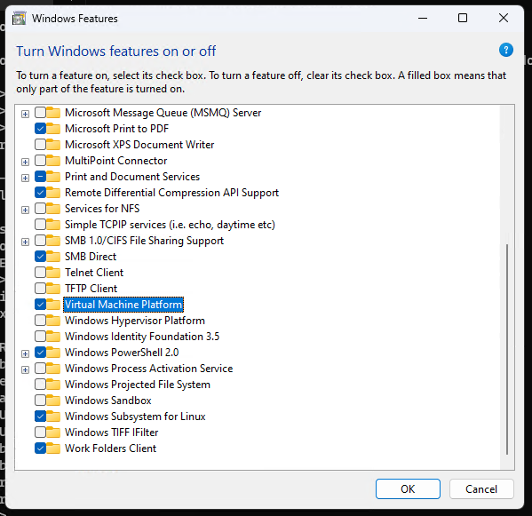

Virtual Machine Platform & Windows Subsystem for Linux 체크 확인


다음 목록에서 알 수 있듯 Arch Linux는 마이크로소프트 공식 지원 배포판이 아님

따라서 유저가 제작한 프로그램을 이용해야됨

[https://github.com/yuk7/ArchWSL](https://github.com/yuk7/ArchWSL)

Arch.exe를 설치해 해당 실행파일이 Arch 배포판 설치를 진행하는데 Arch.exe를 설치할 수 있는 방법은 3가지가 있음

zip 파일에서 설치, appx 파일 설치, scoop 이용

여기서 appx 설치를 이용하도록 하겠다.

https://github.com/yuk7/ArchWSL/releases

우선 위의 링크에서 appx 파일과 cer 파일을 다운 받아주자

온라인이라고 적힌 파일과 아닌 파일이 있는데 그냥 동일한 세트로 다운 받으면 된다.


그 다음 아래 링크에 설명된대로 인증서을 설치하고 appx를 실행 시킨다.

또는 아래 스크립트로 간단하게 완료할 수 도 있다. 물론 yuk7/ArchWSL 릴리즈 업데이트에 따라 버전은 변경해 주어야 한다.

```powershell
Invoke-WebRequest -URI https://github.com/yuk7/ArchWSL/releases/download/22.10.16.0/ArchWSL_Online-AppX_22.10.16.0_x64.cer -OutFile arch.cer
Invoke-WebRequest -URI https://github.com/yuk7/ArchWSL/releases/download/22.10.16.0/ArchWSL_Online-AppX_22.10.16.0_x64.appx -OutFile arch.appx

Import-Certificate -FilePath .\arch.cer -CertStoreLocation Cert:\LocalMachine\TrustedPeople
Add-AppxPackage -Path .\arch.appx
```

[Install Certificate for AppX](https://wsldl-pg.github.io/ArchW-docs/Install-Certificate/)


이후 잠시 기다리면 설치가 완료된다.

[How to Setup](https://wsldl-pg.github.io/ArchW-docs/How-to-Setup/#setup-after-install)

## YAY 설치

아치리눅스의 장점 중 하나인 AUR을 사용하기 편하게 만들어주는 툴이다.

아래 링크를 참고하자

[GitHub - Jguer/yay: Yet another Yogurt - An AUR Helper written in Go](https://github.com/Jguer/yay#installation)

설치 이후에 아래 링크에서 안내하는 작업도한 수행해야된다.

[GitHub - Jguer/yay: Yet another Yogurt - An AUR Helper written in Go](https://github.com/Jguer/yay#first-use)

## ZSH 및 oh-my-zsh, powerlevel10k 설정

### zsh & oh-my-zsh 설정

```
$ sudo pacman -S zsh
$ chsh -l
/bin/sh
/bin/bash
/usr/bin/git-shell
/bin/zsh
/usr/bin/zsh
$ chsh -s /bin/zsh
$ yay -S oh-my-zsh-git
$ cp /usr/share/oh-my-zsh/zshrc ~/.zshrc
```

### powerlevel10k & zsh-syntax-highlighting & zsh-autosuggestions

```
$ sudo git clone --depth=1 https://github.com/romkatv/powerlevel10k.git ${ZSH_CUSTOM:-~/.oh-my-zsh/custom}/themes/powerlevel10k
$ sudo git clone https://github.com/zsh-users/zsh-syntax-highlighting.git ${ZSH_CUSTOM:-~/.oh-my-zsh/custom}/plugins/zsh-syntax-highlighting
$ sudo git clone https://github.com/zsh-users/zsh-autosuggestions ${ZSH_CUSTOM:-~/.oh-my-zsh/custom}/plugins/zsh-autosuggestions
```

.zshrc 파일을 약간 수정해야된다.

ZSH_THEME를 다음과 같이 수정해주자.

```
ZSH_THEME="powerlevel10k/powerlevel10k"
```

또 plugins 항목에 다음을 추가해주자

```
plugins=(
	git
  zsh-syntax-highlighting
  zsh-autosuggestions
)
```

powerlevel10k 테마를 위해 다음 사이트에서 폰트를 설치해주자.

[Nerd Fonts - Iconic font aggregator, glyphs/icons collection, & fonts patcher](https://www.nerdfonts.com/font-downloads)

설치 이후 원도우 터미널에서 Arch 프로필의 폰트를 새로 설치한 폰트로 변경해주자.

터미널을 재시작하거나 source .zshrc를 이용해 변경사항을 적용해주자.

## windows terminal 테마

[Dark theme for Windows Terminal and 302+ apps - Dracula](https://draculatheme.com/windows-terminal)

## 브라우저 설정 및 각종 유틸

[wslu Wiki](https://wslutiliti.es/wslu/install.html#arch-linux)

wslu를 설치한 이후에도 xdg-open 관련 오류가 나타날떈 아래 명령 [https://github.com/cli/cli/issues/826](https://github.com/cli/cli/issues/826) 참

```
sudo ln -s $(which wslview) /usr/local/bin/xdg-open
```

```
$ sudo pacman -S github-cli
$ sudo pacman -S bat
$ yay -S logo-ls
```

알아서 잘 alias도 설정해주자.

## 프로그래밍 언어 설치

### rust

```
sudo pacman -S rustup
rustup default stable
```

.zshrc 파일에 다음 내용 추가

```
## rust cargo install path
export PATH=$PATH:$HOME/.cargo/bin
```

### go

```
yay -Yc
sudo pacman -S go
```

.zshrc 파일에 다음 내용 추가

```
## custom GOPATH & Go config
export GOPATH=$HOME/.go
export PATH=$PATH:$GOPATH/bin
```

### python

```
sudo pacman -S python
```

### node

!여러 버전의 node를 사용해야되는 경우 nvm를 설치하자.

```
sudo pacman -S nodejs npm
```

아치는 모두 최신버전으로 관리해주니까 딱히 asdf-vm 같은거 안써도 된다.

## remove windows unnecessary path

기본적으로 절대 사용하지 않을 원도우 exe 관련 경로가 기본적으로 추가된다.

이로 인해 npm를 실행했는데 원도우에 설치된 npm에 실행되는 등의 해프닝이 벌어진다.

which 명령어를 사용하기 전까지 전혀 알 수 없기에 문제를 해결하지 못하는 상황에 처한다.

이를 위해 다음 작업을 수행해주자.

```
$ sudo vim /etc/wsl.conf

[interop]
appendWindowsPath = false

$ exit
c:\Users\user> wsl --shutdown
c:\Users\user> wsl
$ echo $PATH
```

이러면 문제가 해결되었다.

하지만 몇가지 문제가 추가로 발생한다.

code, clip.exe, explorer.exe 같이 원래 사용하던 소수의 원도우 명령어를 사용할 수 없어진다.

따라서 .zshrc에 다음 설정을 추가해주자.

```
## windows necessary path
export PATH="$PATH:/mnt/c/Users/minpeter/AppData/Local/Programs/Microsoft VS Code/bin:/mnt/c/Windows/system32:/mnt/c/Windows/System32/WindowsPowerShell/v1.0:/mnt/c/Program Files/Docker/Docker/resources/bin"
```

사실 처음에는 git-credential-manager.exe 도 추가하려했으나 .gitconfig 파일에 경로가 정의되어있기에 문제가 없다고 판단했다.


상당히 아름다운 터미널이 완성됬다.

여기에 vscode 설치하고 익스텐션 몇개만 설치하면 완벽한 개발 환경이다.
