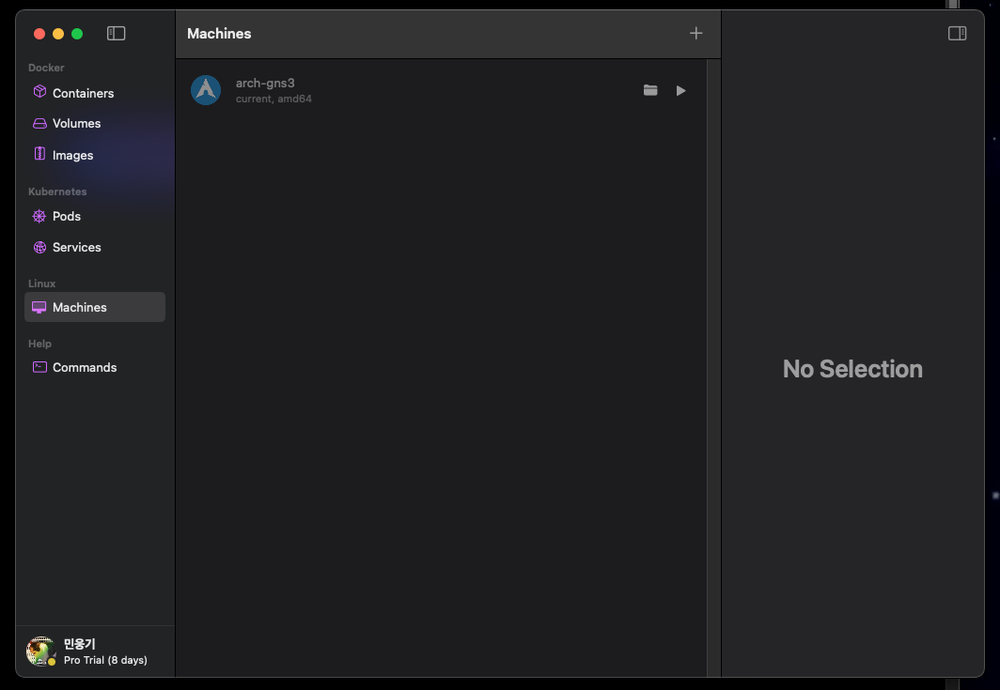
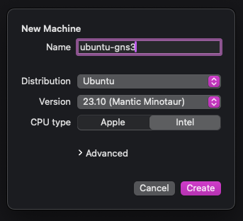
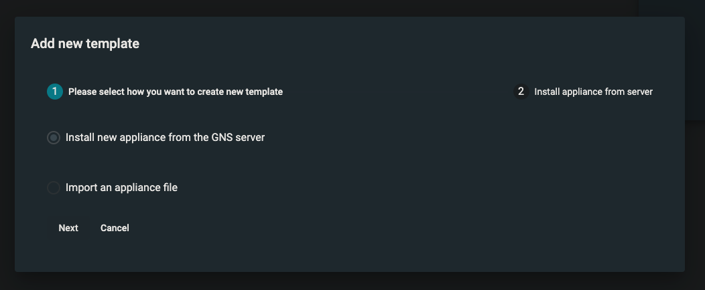
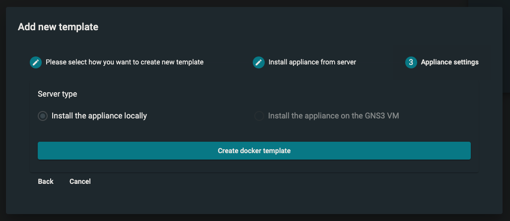
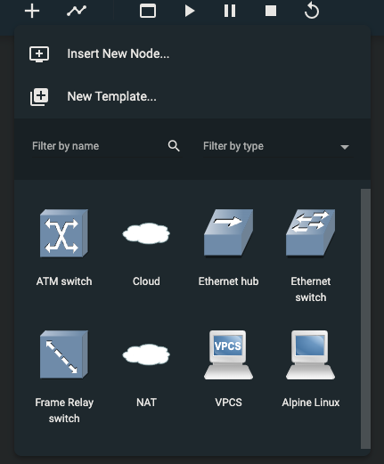
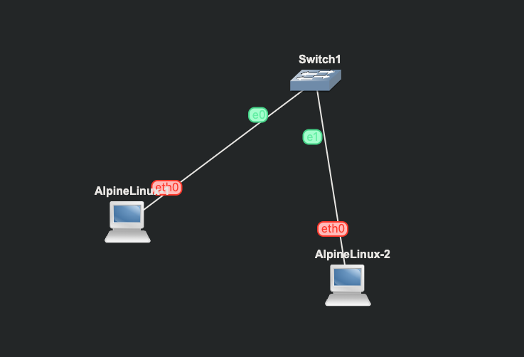
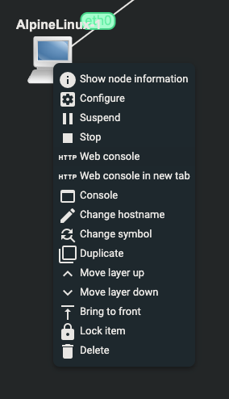
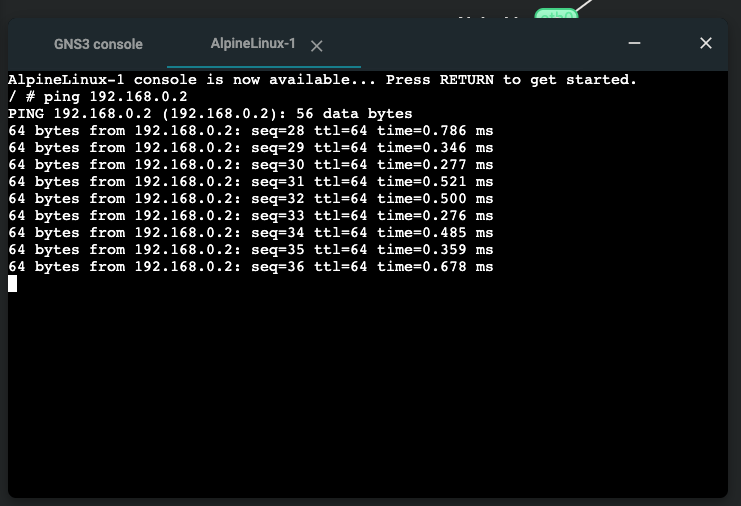
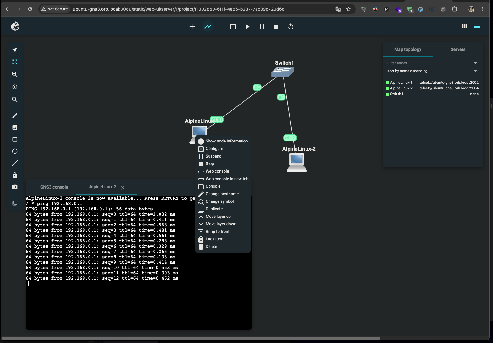

## 서론

이 튜토리얼에서는 맥북에서 orbstack의 linux vm 환경 내부에서 docker를 이용해 GNS3를 띄우고 간단한 토플로지를 실행합니다.

이러한 설정의 장점은 다음과 같습니다.

1. 설치하기 간편하고
2. 시스템으로부터 격리되어 문제의 소지가 줄어듬

gns3 desktop 설정과 패킷 캡쳐는 해당 글에서 다루는 범위가 아니며 라우터, 스위치를 통해 알파인 도커 컨테이너의 라우팅을 테스트하는 것을 목표로 합니다.

또한 아래 프로젝트에 의존하고 있습니다.

[https://github.com/jsimonetti/docker-gns3-server](https://github.com/jsimonetti/docker-gns3-server)

## 맥북에 x86 docker 실행환경 구축

몇번의 테스트 결과 arm64 환경의 도커 위에서 gns3-server의 특정 네트워킹 기능을 정상 동작하지 않는다는 것을 발견하였습니다.

이에 정상적인 실험을 위해 가상머신을 이용, 로제타를 이용해 x86 환경을 시뮬레이팅 할 것입니다.

만약 본인이 윈도우거나 x86 기반의 환경이고 도커가 설치되어 있다면 이 파트로 넘어가도 좋습니다.

[https://orbstack.dev/download](https://orbstack.dev/download)에서 파일을 다운받거나 `brew install orbstack`를 실행하여 설치해줍니다.

설치 후 실행하여 Machines 탭으로 이동해줍니다.



아래와 동일한 설정 (Ubuntu, CPU type: intel)로 생성합니다.



더블 클릭하여 터미널을 열어줍니다.


다음 명령을 순서대로 입력하여 도커를 설정해줍니다.

```bash
cd ~
curl -L get.docker.com | sh
```

아래 명령을 실행하여 도커 설치를 확인합니다.

```bash
sudo docker version
sudo docker ps
```

## docker 위에 gns3-server 올리기

위에서 이어서 도커가 설치된 x86 환경의 터미널이라고 가정합니다.

아래 명령을 실행하여 gns3 데이터 저장을 위한 폴더를 만들어줍니다.

```bash
mkdir gns3-data
```

이후 아래 명령을 통해 gns3-server를 실행합니다.

```bash
sudo docker run \
    --rm -d \
    --name gns3 \
    --net=host --privileged \
    -e BRIDGE_ADDRESS="172.21.1.1/24" \
    -v ./gns3-server:/data \
    jsimonetti/gns3-server:latest
```

이제 맥북에서 [http://ubuntu-gns3.orb.local:3080/](http://ubuntu-gns3.orb.local:3080/)으로 접속합니다. 만약 orbstack를 사용하고 있지 않는 경우 [http://localhost:3080](http://localhost:3080) 또는 가상머신의 아이피와 3080 포트로 접근합니다.

\*가상머신의 이름이 다른 경우에도 주소가 다를 수 있습니다. [https://orb.local/](https://orb.local/)에서 실행중인 주소 확인 가능


웹 UI에 접속할 수 있게 됩니다.

## 엄청 간단한 GNS3 실습

gns3 내부에서 도커 컨테이너 2개를 생성해 아이피를 할당하고 스위치를 통해 통신이 가능한지 실습해보겠습니다.

`Add blank project`를 누르고 아무 이름이나 입력합니다.


위쪽 중앙에 `+` 버튼을 눌러 `New Template...`를 선택해줍니다.



Next를 누른 후 필터에 alpine를 검색해줍니다. 이후 목록 중 Emulator 타입이 Docker인 아이템의 Actions에서 다운로드 아이콘을 눌러줍니다.



`Create docker template`를 눌러 작업을 마무리합니다.



해당 창에서 Alpine Linux 2개와 Ethernet switch 1개를 꺼내줍니다.


`+` 옆에 버튼으로 선을 연결해줍니다.



각각 Alpine Linux 머신을 우클릭 해 `Configure` 메뉴를 열고 `Edit network configuration` 를 클릭 해줍니다.

아래 내용을 붙혀넣습니다. (서로 address가 다른 점에 유의합니다.)

```text
#alpine linux 1
auto eth0
iface eth0 inet static
	address 192.168.0.1
	netmask 255.255.255.0
```

```text
#alpine linux 2
auto eth0
iface eth0 inet static
	address 192.168.0.2
	netmask 255.255.255.0
```

위에서 실행 버튼을 찾아서 눌러줍니다.



노드를 우클릭하여 `Web console` 를 눌러줍니다. (alpine 1, alpine 2 둘 다)



위와 같이 Alpine 1에서 192.168.0.2로 Alpine2에서 192.168.0.1로 핑이 성공하는지 테스트 합니다.

성공입니다 :)



gns3-desktop도 쓸만 했었고 EVE-ng도 대단하지만 리눅스 라우팅 테이블 실험하는 정도면 이 설정이 가볍고 좋은거 같습니다.
